# Expense Management System

## GitHub Repo Link: 
```bash 
  https://github.com/Prakashsaw/Expense-Management-System
```
## Live Demo URL: 
```bash 
  https://expense-management-system-prakash.netlify.app/
```

## Description
* Created a web-based expense management system to help users track and manage their financial transactions.
* User Login and SignUp functionality with full validation(email validation through sending email), bcrypt passsword in backend, JWT token for secure user authentication.
* Feature of forgot password with sending email for reset password link using nodemailer.
* Record and categorize expenses on weekly, monthly and yearly, Expense analytics and visualizations in graphs and charts, user can edit and delete transactions.


## Tech Stack

**Frontend:** React.js, Bootstrap, Ant Design, CSS.

**Backend:** Node.js, Express.js.

**Database:** MongoDB.


## Run Locally

**Step:1-** Clone the project

```bash
  git clone https://github.com/Prakashsaw/Expense-Management-System.git
```

**Step:2-** Go to the project directory

```bash
  cd Expense-Management-System
```

**Step:3-** Install all the dependencies in client and server folders one by one.

* Installl dependencies for client
```bash
  cd client/
  npm install
```
* Installl dependencies for server
```bash
  cd server/
  npm install
```

**Step:4-** Make .env file in your server folder which will contain all your development environment variables with private keys
```bash
  MONGO_URL =
  PORT =
  BCRYPT_SALT =
  JWT_SECRETE_KEY =
  EXPIRE_IN =

  EMAIL_HOST =
  EMAIL_PORT =
  EMAIL_USER =
  EMAIL_PASS =
  EMAIL_FROM =

  FAST2SMS_API_KEY =
```

**Step:5-** Start client and server in seperate two terminal

* Start the client
```bash
  //open new terminal
  cd client
  npm run start
```

* Start the server
```bash
  //open new terminal
  cd server
  npm run start
```

**Step:6-** Now Expense Management System App is running in your local system.

## Features 🚀  

- **User Registration & Login** with complete validation.  
- **Email Verification:** Users receive a confirmation link via email to verify their email address.  
- **Secure Authentication & Authorization** using JWT tokens.  
- **Forgot Password:** Users can reset their password if they forget it.  
- **Profile Management:** Users can update their profile details and change their password after logging in.  
- **Transaction Management:** Users can add, edit, and delete transactions with confirmation prompts.  
- **Financial Tracking:** Users can view transactions on a **weekly, monthly, and yearly basis** with filtering options.  
- **Custom Date Filtering:** Users can view transaction history by selecting specific date ranges.  
- **Category-Based Filtering:** Users can filter transactions by **income, expenses, or both**.  
- **Expense Analytics & Visualizations:** Users can analyze their expenses through **graphs and charts**.  

## Screenshots 📸
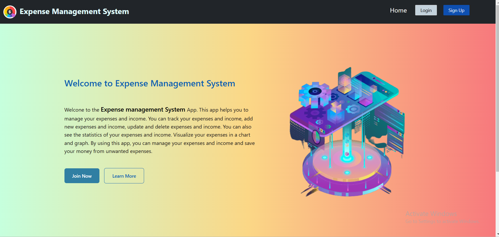
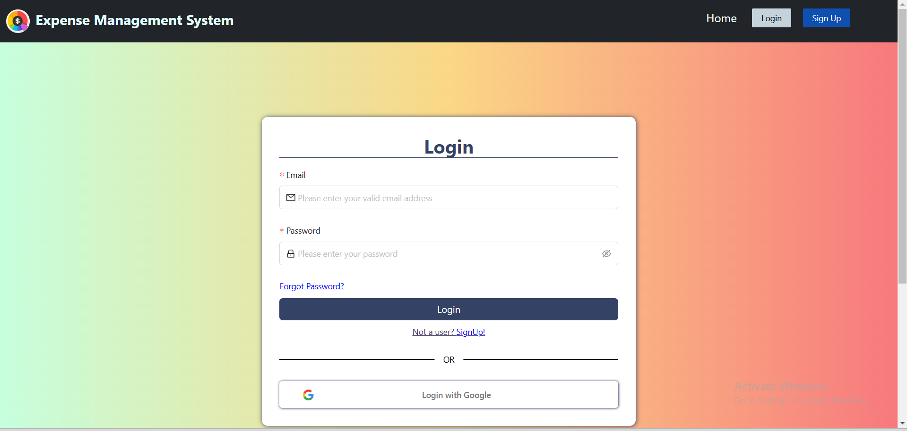
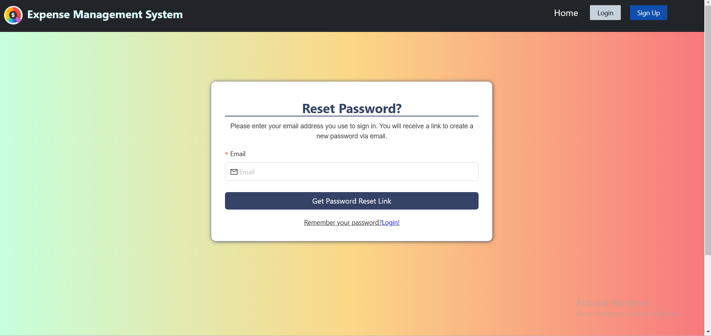
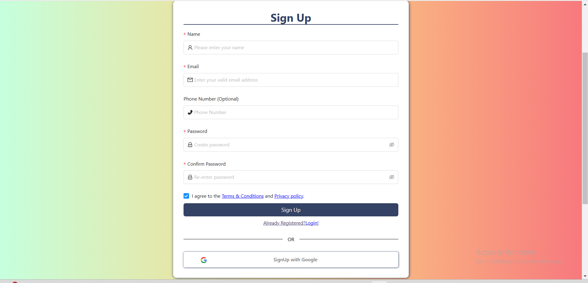
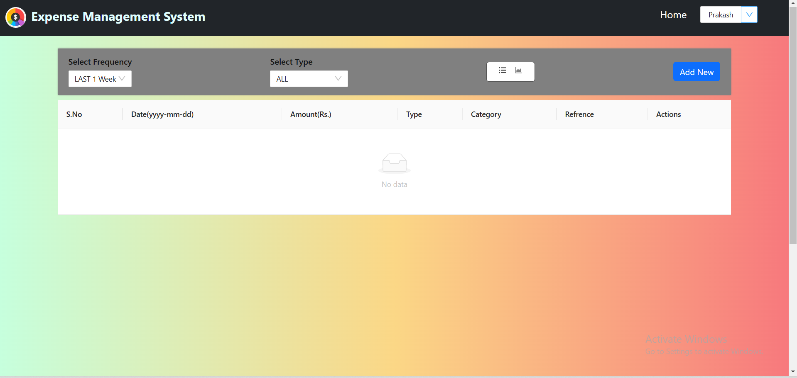
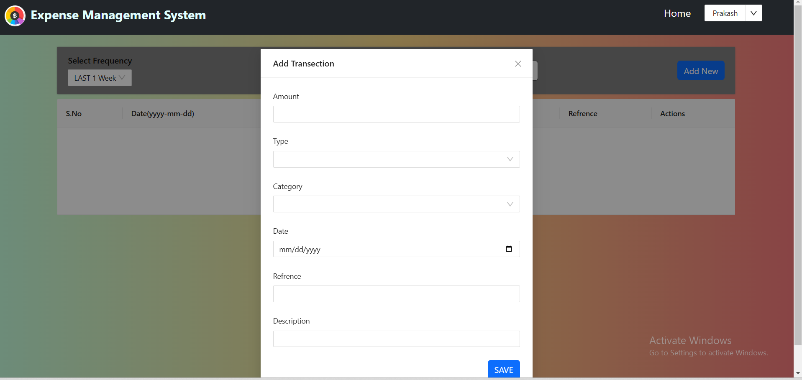
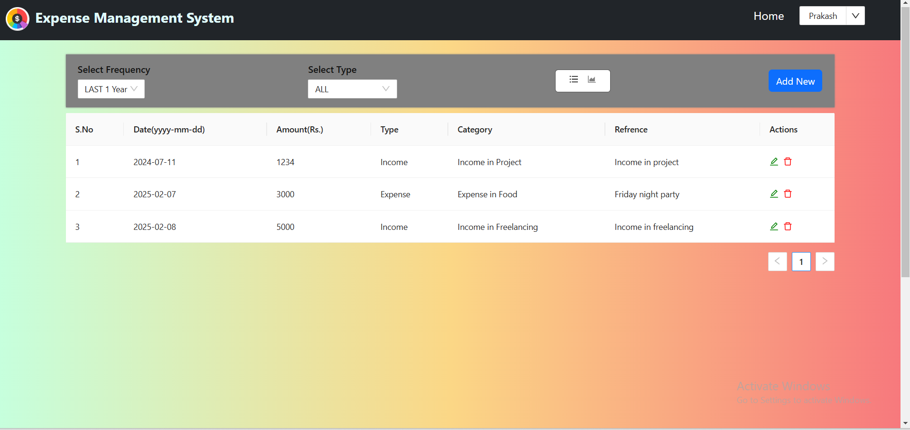

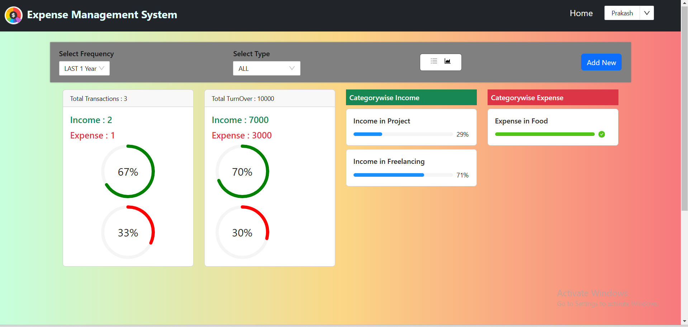
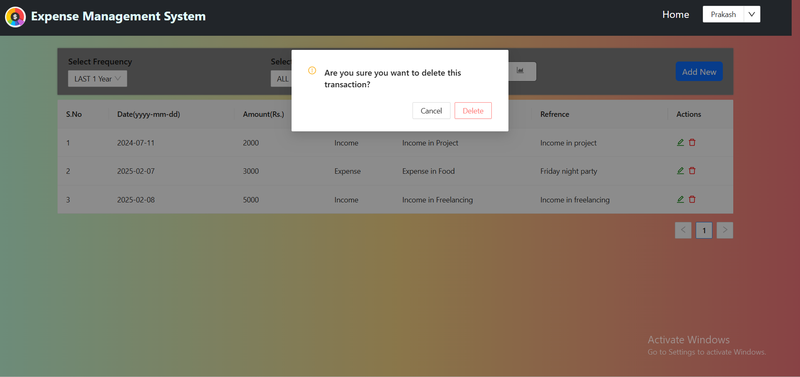

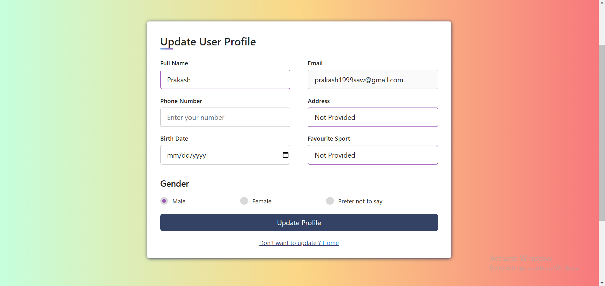
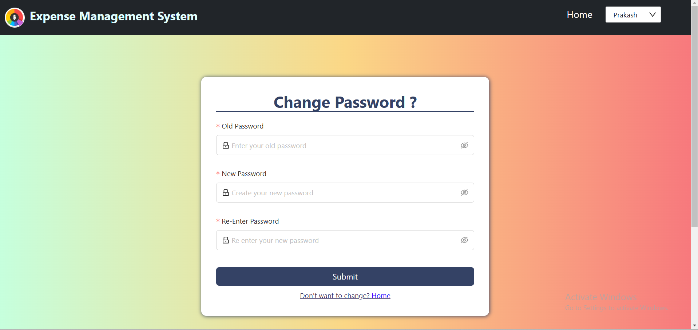
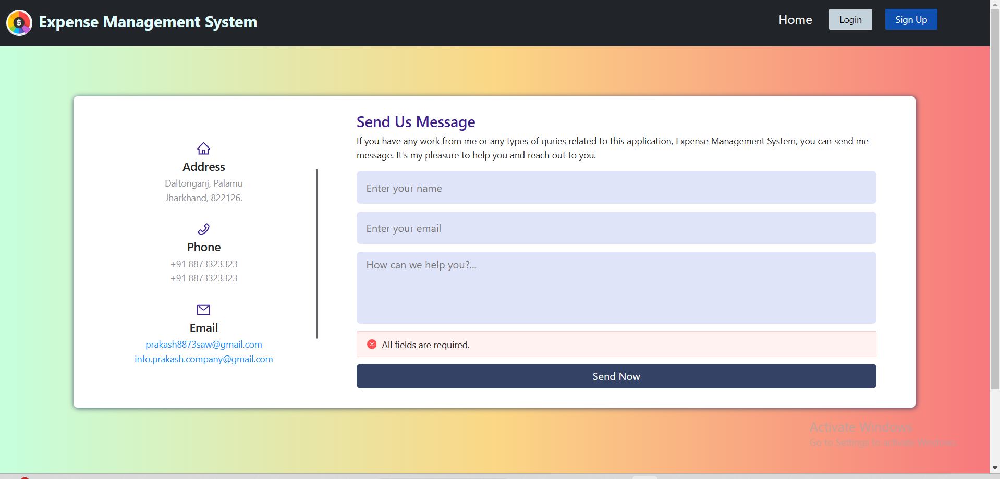
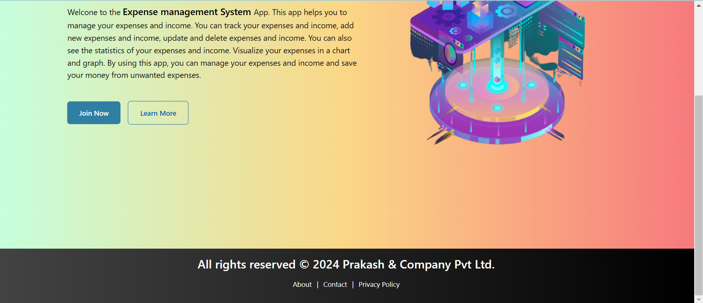

## Made By
- [@Prakashsaw](https://github.com/Prakashsaw)
